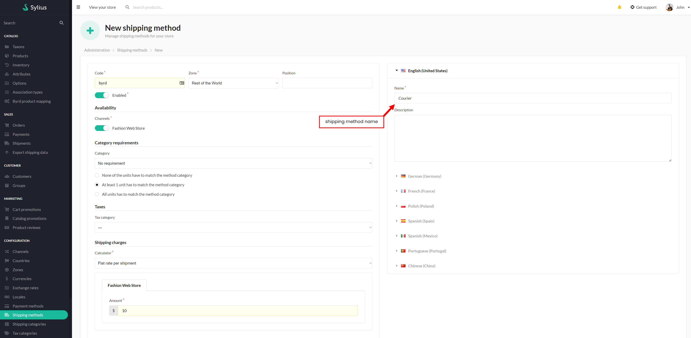
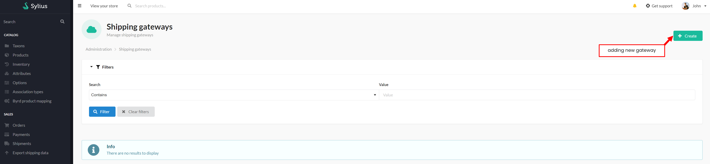
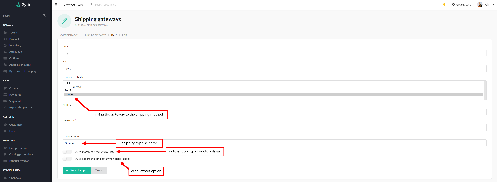
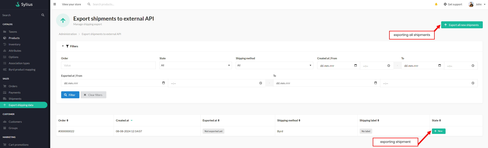
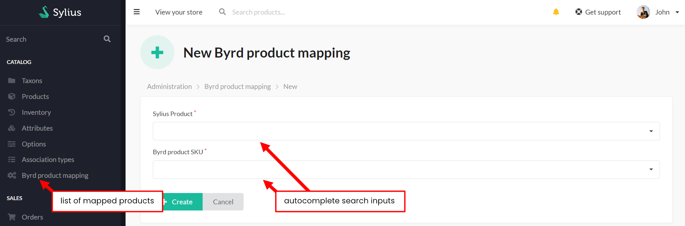

# Functionalities

---
### Introduction
Byrd Technologies, known as "byrd," is fulfillment company specializing in e-commerce solutions.
The company provides third-party logistics (3PL) services,
helping online retailers manage and optimize their shipping and fulfillment processes across Europe.

This plugin supports communication with the Byrd API,
including exporting shipping data and mapping Sylius SKU with Byrd SKU directly from the order.
During the data import, Byrd receives information about what to ship and to what address, and shipping is done from their warehouses.

### Usage

---
#### Adding Shipping Gate

After installation, users can add the shipping method corresponding to the service provider
to which they want to export shipments.

    

 

It then creates a new "shipping gateway" for the added shipping method.
When a customer selects this shipping method when ordering products, the order will be captured by the gateway.

    

 

Selects the shipping method and completes the form fields accordingly.
It allows you to choose three types of shipment:
- standard
- express
- economy

Additionally, it has an auto-export option when the order is paid
and the possibility to run automapping of the Sylius SKU and the Byrd warehouse SKU.
The manual SKU mapping option is shown below.

    

 

#### Shipping Exports
Once the shipping method and shipping gateway for the shipping provider are created,
customer can use this shipping method during a checkout. When the order is placed,
user can now go to the 'Export shipping data' section from Sylius Admin Panel and export chosen shipments.

    

 

#### Byrd's products mapping
It allows to auto and manual mapping Sylius SKU with Byrd SKU.

    

